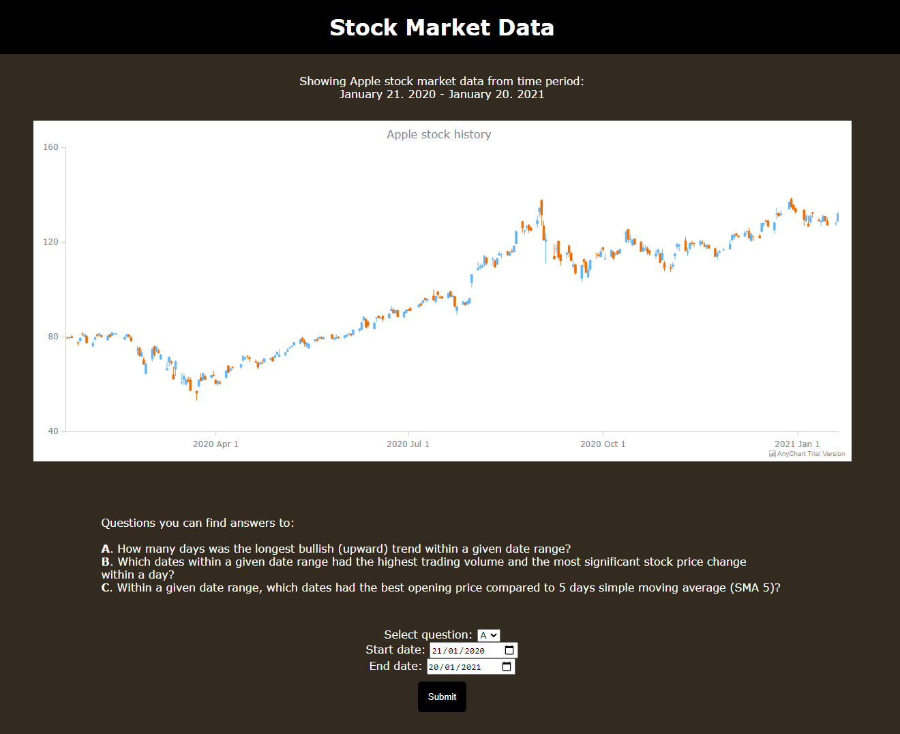

# Stock Market Data

## Properties
- HTML/CSS/JavaScript, desktop version, not optimized for mobile  
- using parsed csv stock data to calculate answers to questions given by user
- getData(): using Fetch to get stock market data (csv) from file  
- parseCSV(): parsing csv data with a function to remove dollar signs ($), async  
- using AnyChart to create and show all the data visually in a chart, async (shows only if data is loaded and parsed properly)  
- UI shows selectable questions, select for choosing question, and inputs for selecting date range (start date and end date) 
- checkDate(), function called by event listener, shows timed alert if user tries to input a weekend date, prevents calculation errors because data includes no weekend dates  
- parseDate(): parse the dates given by user to match date format in csv so the dates can be compared to data  
- calc(), function called by event listener when submit is pressed, get user selections of question and dates, turns csv data into array, array.slice() to select portion of array based by given date range, each values from date range (date, volume, open, close, high, low) pushed into their own arrays for further calculations/comparisons 
- switch-function inside calc(): does actual calculations based on question (A, B or C)
- A: compares close values within given date range (counter) to find the longest upward trend, returns to UI simply how many days the longest trend lasts
- B: uses high and low values to calculate daily stock price changes, creates new array with date, volume and calculated pricechange and sorts it in descending order based on volume (or pricechange if volumes are the same), sorted array sent to createTable-function to create a table, returns to UI on which days was the highest volume and pricechange and createTable()-made table to show answer-data  
- C: calculates SMA 5 using the average value of closing prices between days n-1 and n-5, calculates how many percentages (%) is the difference between the opening price of the day and the calculated SMA 5 price of the day, creates an array of dates and the precentages (sorted by percentages) which is sent to createTable() to show answer-data in UI
- createTable(): gets headers and data array from calc()/switch function, dynamically creates table with DOM to show the answers in answer-data div  
- user can keep selecting new questions and date ranges, UI (answer or answer-data divs) is emptied when user makes new submit 

## Task description
Company has a new customer, Scrooge McDuck.  
  
Scrooge wants to make a fortune by analyzing historical stock market data, and he has ordered an application that provides some statistics about stock prices. However the app should not cost too much.  
  
Your job is to implement an MVP (minimum viable product) for Scrooge using any technology you want. (Web page, mobile application, console application, Web API etc.)  

1. Scrooge wants to import historical stock data from a CSV file into the application.  
  
Sample data can be downloaded via Nasdaq web site or API.  
Apple stock historical data:  
https://www.nasdaq.com/market-activity/stocks/aapl/historical  
https://www.nasdaq.com/api/v1/historical/AAPL/stocks/2020-01-20/2021-01-20  

CSV data format example:  
“Date, Close/Last, Volume, Open, High, Low  
01/19/2021, $127.83, 90757330, $127.78, $128.71, $126.938”  
  
  
2. Scrooge wants answers to following questions A - C.  

A. How many days was the longest bullish (upward) trend within a given date range?  
  
- Definition of an upward trend shall be: “Closing price of day N is higher than closing price of day N-1”  
- Read start date and end date of the date range from user input (or pass them as input parameters via the API if your MVP does not have an user interface).  
- Both start and end date shall be included to the date range.  
- Expected output: The max amount of days the stock price was increasing in a row  
  
Example: In Apple stock historical data the Close/Last price increased 3 days in a row between 01/06/2021 and 01/08/2021.  
  
B. Which dates within a given date range had a) the highest trading volume and b) the most significant stock price change within a day?  
  
- Use High and Low prices to calculate the stock price change within a day. (Stock price change from 2$ to 1$ is equally significant as change from 1$ to 2$.)  
- Expected output: List of dates, volumes and price changes. The list is ordered by volume and price change. So if two dates have the same volume, the one with the more significant price change should come first.   
  
C. Within a given date range, which dates had the best opening price compared to 5 days simple moving average (SMA 5)?  
  
- Calculate simple moving average for day N using the average value of closing prices between days N-1 to N-5.  
- Calculate how many percentages (%) is the difference between the opening price of the day and the calculated SMA 5 price of the day.  
- Expected output: List of dates and price change percentages. The list is ordered by price change percentages.  
  
You can return the source code for example via GitHub or email. Company will review the code, and we like clean, maintainable code that follows good coding conventions. You may ask if you have any questions, and have fun coding.  
